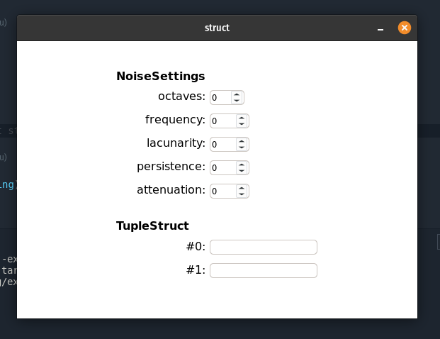

# Changelog


## 0.5.0
### Added
- Allow struct fields
### Changed:
- the `submit_fn` in `AsHtml::as_html` is now a `String` instead of a `&'static str`

### Example:
```rust
#[derive(AsHtml, Debug)]
pub struct NoiseSettings {
    octaves: usize,
    frequency: f64,
    lacunarity: f64,
    persistence: f64,
    attenuation: f64,
}

#[derive(AsHtml, Debug, Default)]
pub struct TupleStruct(String, String);
```



## 0.4.0
- update to bevy 0.4