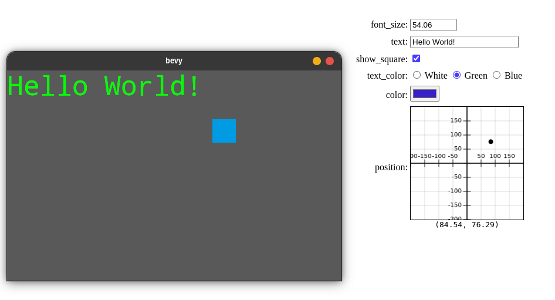

# bevy-contrib-inspector

<div align="center">
  <!-- Crates version -->
  <a href="https://crates.io/crates/bevy-contrib-inspector">
    
  </a>
  <!-- docs.rs docs -->
  <a href="https://docs.rs/bevy-contrib-inspector">
    
  </a>
  <!-- License -->
    
</div>
<br/>

This crate provides the ability to annotate structs with a `#[derive(Inspectable)]`,
which opens a web interface (by default on port 5676) where you can visually edit the values of your struct live.

Your struct will then be available to you as a bevy resource.



## Example
```rust
use bevy_contrib_inspector::Inspectable;

#[derive(Inspectable, Default)]
struct Data {
    should_render: bool,
    text: String,
    #[inspectable(min = 42.0, max = 100.0)]
    size: f32,
}
```
Add the `InspectorPlugin` to your App.
```rust
use bevy_contrib_inspector::InspectorPlugin;

fn main() {
    App::build()
        .add_default_plugins()
        .add_plugin(InspectorPlugin::<Data>::new())
        .add_system(your_system.system())
        // ...
        .run();
}

fn your_system(data: Res<Data>, mut query: Query<...>) { /* */ }
```
To automatically open the webbrowser when starting, run your program using `BEVY_INSPECTOR_OPEN=1 cargo run`.

## Attributes
When deriving the `Inspectable` trait, you can set options such like the port the server will run on like so:
```rust
#[derive(Inspectable, Default)]
#[inspectable(port = 1234)]
struct Data {
   #[inspectable(a = 1, b = 2, c = 3)]
   field: Type,
}
```
The attribute on the struct will accept fields of the type `InspectableOptions`,
while the attributes on the fields accept those of their `<Type as AsHtml>::Options`.

## Features
`native`: Instead of opening the inspector window in a browser, start a webkit2gtk window.

On ubuntu, the feature requires `sudo apt install libwebkit2gtk-4.0-dev`